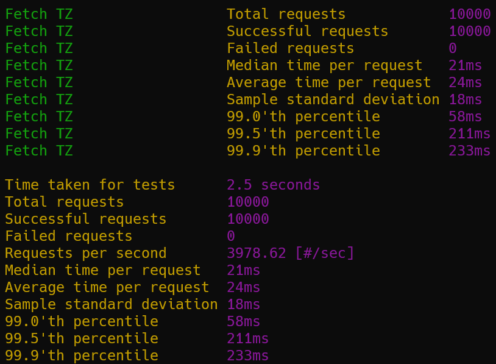

[](https://github.com/twitchax/rtz/actions/workflows/build.yml)
[](https://codecov.io/gh/twitchax/rtz)
[](https://crates.io/crates/rtz)
[](https://crates.io/crates/rtz)
[](https://github.com/twitchax/rtz/releases)
[](https://www.npmjs.com/package/rtzweb)
[](https://docs.rs/rtz)
[](https://github.com/twitchax/rtz)
[](https://opensource.org/licenses/MIT)

# rtz

A self-contained timezone library / binary / server for Rust / JS (via WASM) ([free server](http://tz.twitchax.com/api/tz/30/30)) using data from the [Natural Earth](https://www.naturalearthdata.com/) dataset.

## Free Server

Server is deployed to four regions across the globe, and is available at [tz.twitchax.com](http://tz.twitchax.com/api/tz/30/30).  Each region is currently 
capable of supporting around 8,000 RPS, and is deployed to the following regions: sea, iad, ams, hkg.

Requests take the form of `http://tz.twitchax.com/api/tz/{lng}/{lat}`.

Example request:

```bash
$ curl http://tz.twitchax.com/api/tz/30/30

{"id":65,"objectid":17,"friendlyName":"Europe/Mariehamn","description":"Libya, Egypt, Bulgaria, Cyprus, Greece, Israel, Jordan, Lebanon, Moldova, Palestine, Romania, Syria, Turkey, Ukraine","dstDescription":"Bulgaria, Cyprus, Greece, Israel, Jordan, Lebanon, Moldova, Palestine, Romania, Syria, Turkey, Ukraine","offsetStr":"UTC+02:00","zoneNum":2,"zoneStr":"+2","rawOffset":7200}
```

HTTPS is also available, but is not recommended due to the performance overhead for the client and the server, and the lack of sensitive data being transmitted.

## Binary Usage

### Install

Windows:

```powershell
$ iwr https://github.com/twitchax/rtz/releases/latest/download/rtz_x86_64-pc-windows-gnu.zip
$ Expand-Archive rtz_x86_64-pc-windows-gnu.zip -DestinationPath C:\Users\%USERNAME%\AppData\Local\Programs\rtz
```

Mac OS (Apple Silicon):

```bash
$ curl -LO https://github.com/twitchax/rtz/releases/latest/download/rtz_aarch64-apple-darwin.zip
$ unzip rtz_aarch64-apple-darwin.zip -d /usr/local/bin
$ chmod a+x /usr/local/bin/rtz
```

Linux:

```bash
$ curl -LO https://github.com/twitchax/rtz/releases/latest/download/rtz_x86_64-unknown-linux-gnu.zip
$ unzip rtz_x86_64-unknown-linux-gnu.zip -d /usr/local/bin
$ chmod a+x /usr/local/bin/rtz
```

Cargo:

```bash
$ cargo install rtz
```

NPM:

```bash
$ npm install --save rtzweb
```

### Help Docs

```bash
$ rtz

A tool to easily work with time zones via a binary, a library, or a server.

Usage: rtz [COMMAND]

Commands:
  resolve   Resolve a timezone from a lng,lat pair
  generate  Generate the bincoded timezone and cache files
  help      Print this message or the help of the given subcommand(s)

Options:
  -h, --help     Print help
  -V, --version  Print version
```

### Resolve a Time Zone

```bash
$ rtz resolve "-87.62,41.88"

Friendly Name:   America/Chicago
UTC Offset:      UTC-06:00
Offset Seconds:  -21600
Description:     Canada (almost all of Saskatchewan), Costa Rica, El Salvador, Ecuador (Galapagos Islands), Guatemala, Honduras, Mexico (most), Nicaragua,
DST Description: Canada (Manitoba), United States (Illinois, most of Texas)
```

### Generate the Cache Files

```bash
$ rtz generate /assets/ne_10m_time_zones.geojson
```

### Run with Wasmer

```bash
wasmer run twitchax/rtz -- resolve 30,30
```

### Run the Server

```bash
$ cargo install rtz --features web
$ rtz serve
```

```bash
$ docker run -it --rm -p 8082 twitchax/rtx
```

## Library Usage

Add this to your `Cargo.toml`:

```toml
[dependencies]
rtz = "*" #choose a version
```

### Examples

```rust
use rtzlib::base::geo::get_timezone;

// Query a time zone for a given `(lng,lat)`.
assert_eq!(
    get_timezone(-121., 46.)
        .unwrap()
        .friendly_name
        .as_ref()
        .unwrap(),
    "America/Los_Angeles"
);
```

## JS Usage

The npm package is available [here](https://www.npmjs.com/package/rtzweb).

First, load the module as you would any other ES module.

```js
import * as rtz from 'rtzweb/rtzlib.js';
```

Then, you can use the library similarly as you would in Rust.

```js
let tz = rtz.getTimeZone(-121, 46);
tz.friendly_name; // "America/Los_Angeles"
```

## Feature Flags

The library and binary both support various feature flags.  Of most important note are:
* `default = ["cli"]`
* `cli`: enables the CLI features, and can be removed if only compiling the library.
* `wasm`: enables the WASM features, and is required to build an NPM package via `wasm-pack`.
* `web`: enables the `serve` subcommand, which starts a Rocket web server that can respond to time zone requests.

## Performance

### General

This implementation trades binary size for performance by employing an in-binary cache that improves average timezone resolution by about 96x, and worst-case resolution by about 10x.  The cache is generated from the [Natural Earth](https://www.naturalearthdata.com/) dataset, and is included in the binary.  The cache is generated by the `generate` subcommand, and is stored in the `assets` directory.


### Free Server

Below is the sample performance to resolve a time zone from a `(lng,lat)` pair to one of the data centers using a concurrency of 1,000, achieving 8,000 RPS.


Below is the sample performance to resolve a time zone from a `(lng,lat)` pair to one of the data centers using a concurrency of 100, achieving an average response time of `24 ms`.



## Test

```bash
cargo test
```

## Bench

```bash
cargo bench
```

## License

MIT